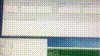
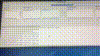

# MitUnUsedImgChecker
## 如何使用 🚀
| 功能 | 使用方式 |
| --- |  --- |
| 扫描图片 | |
| 定位图片位置 | |

---

### 更多功能
| 功能  | 是否支持 |
| --- |  --- |
| 自定义扫描图片类型   | ✅ |
| 自定义图片子路径黑名单   | ✅ |
| 自定义被扫描文件子路径黑名单   | ✅ |
| 自定义被扫描文件类型   | ✅ |
| 自定义被扫描文件类型   | ✅ |
| 代码片段扫描自定义图片前缀  | ❌ |

---

## 如何安装 🖥
### Download from git，build && run with Xcode 

---
