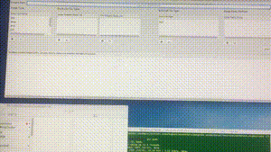
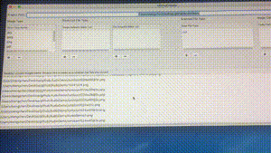

# MitImgChecker
 
   

| [中文](../README.md)  | English |
> I have realize the function with python while the way is coupling serious. This time I use swift to rewrite the function and offer more custom function. 

## How to use? 🚀
| Function | way |
| --- |  --- |
| Scan images | |
| Locate a image in Finder | |

---

### More Function
| Function  | is support? |
| --- |  --- |
| Custom scan image type   | ✅ |
| Custom scan image subpath black list  | ✅ |
| Custom scanned file subpath black list  | ✅ |
| Custom scanned file type  | ✅ |
| Code snippets scan for custom image prefixes  | ✅ |
| Check different name of .imageset and image(for iOS/MacOS project) but use the content of imageset in project | ✅ |
| Content repetition image detection capability  | ✅ |
---

## How to Install 🖥
### Download from git and run with Xcode 

---
## Introdution
+ [Introdution](https://mitchell-dream-god.com/2019/08/25/ios-check-repeated-and-unused-image/)

---
